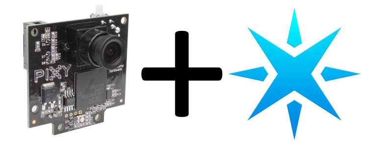
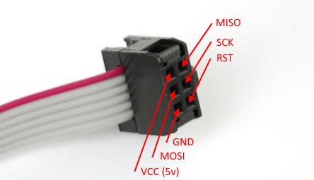

# Spark Pixy
A library & examples interacting with the Pixy using a Spark Core

## State of Library
| Connection Type | State |
| ----- | ----- |
| SPI | Tested & Works |
| I2C | Untested |
| UART | Untested |
| Analog/Digital | Untested |

## Connection To Spark
### via SPI
Connecting the Spark Core to the Pixy over SPI is rather simple. Using the cable provided with the pixy, put a jumber between the connector (shown below) and the Spark Core (shown on the table).

| Pixy | Spark Core |
| ---- | ---- |
| MISO | A4 |
| VCC | VIN |
| SCK | A3 |
| MOSI | A5 |
| RST | NC |
| GND | GND |

## Examples
Examples can be found in the example folder. 

### HelloWorld
A simple hello world application which prints out information on the blocks the pixy has detected

### 1DServoFollower
A more advanced example which uses the pixy and a servo to track an object from side to side (1 dimensional)

YouTube Video: https://www.youtube.com/watch?v=l0pi_0FXljk

### 1DServoFollowerFast
A slightly more advanced version of the 1DServoFollower example. Moved the servo at rate proportional to the error instead of a constant rate.

YouTube Video: https://www.youtube.com/watch?v=q764IZ9fZNA